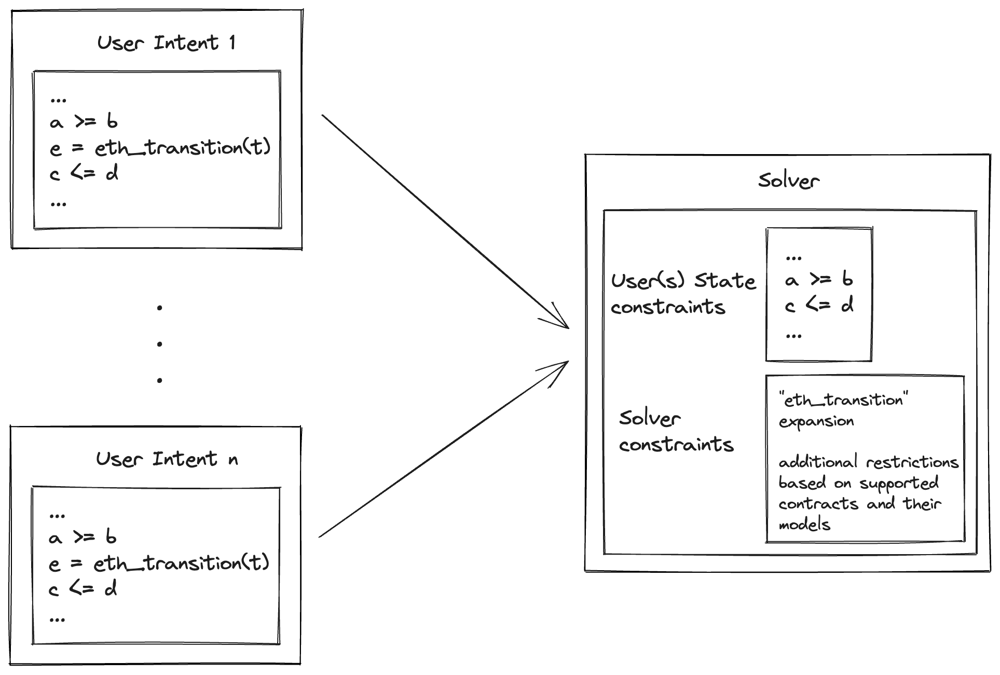

# State Transition Function

The state transition function, which we called $tau$ in the [introduction](introduction.md), is the function that maps a given state $s_0$ to another state $s_1$ by executing a transaction $t$. That is, $s_1 = \tau(s_0, t)$. On Ethereum, $\tau$ is basically the process of validating and executing $t$ using the EVM. Every user intent requires $\tau$ in order to express an actual state transition.

In the DSL examples presented in [introduction](introduction.md), we've used `eth_transition` to refer to the state transition function of Ethereum which takes a particular state (e.g. ETH balance of some address `a`) and an arbitrary transaction $t$, and returns the new ETH balance of `a` after a successful execution of $t$. Mathematically, this definition of `eth_transition` is quite vague and informal. We need to further specify what it will actually look and how solvers should handle it.

## Expressing `eth_transition`

From the point of view of users, `eth_transition` can simply be a black box. Users do not really care about the state transition function of any blockchain and all they want to do is express some state transition. Therefore, users should have to write the least amount of code to express the relationship between start and end states.

Conversely, solvers need to "expand" `eth_transition` to something more concrete that can be plugged into a mathematical solver. One can imagine a _magical_ solver that is able to traverse the space of feasible transactions while iteratively evaluating (via code execution) the next state given a sequence of candidate transactions, but such a solver will be incredibly slow. Therefore, solvers need to come up with something better.

One viable option is to restrict the space of feasible transactions to contract calls to specific contracts with well-defined mathematical models such as Uniswap. For each trusted contract, the solver has to replace calls to `eth_transition` with actual equations representing the state transition function **for that contract**. The result is a modified version of the user's initial intent, with the solver introducing additional constraints alongside those specified by the user. By applying more restrictive constraints to `eth_transition`, solvers reduce the transaction space, making it easier to navigate. This approach enables solvers to provide users with valid solutions in a timely manner.



Solvers compete by delivering the best "expansion" of `eth_transition`, striving to provide a solution that is more optimal relative to those proposed by other solvers. Solvers who are able to include more contracts in their solution space will likely achieve higher satisfaction scores, hence receiving higher rewards.

Expanding the search space is largely a question of domain knowledge. For example, in the case of swaps, a solver should be aware of as many swap venues and pairs as possible. They should also run an order matching algorithm to match swaps where possible, as this will bypass a lot of expensive state access and contract calls. This also means that solvers will also compete on compute power, since a larger search space is more expensive to explore.

This flow of intents above can be combined with intent batching that was explained in the [introduction](introduction.md) to make the process more efficient and to explore user matching opportunities.

### Constant Function Market Maker (CFMM) Example

Consider the swap example from the [introduction](introduction.md) where the user is requesting a state change that can be expressed mathematically as follows:

$$
\begin{aligned}
e_0 - e_1 &= 3e18\\
d_1 - d_0 &\geq 5400e6 \\
\end{aligned}
$$

where:

- $e_0$ and $d_0$ are the starting ETH and DAI balances of the user, respectively.
- $e_1$ and $d_1$ are the final ETH and DAI balances of the user, respectively.

These constraints on the change in state are then broadcast to the network of solvers. Solvers will then attempt to provide a solution to the intent above by exploring the list of contracts they are willing to interact with. For CFMM contracts, the trading semantics rely on a trading function $\varphi$ such that:

$$\varphi(R_e + \gamma\delta_e, R_d - \delta_d) = \varphi(R_e, R_d)$$

where $R_e$ and $R_d$ are the current reserves of ETH and DAI respectively, $\gamma \in (0, 1]$ is the trading fee for the CFMM, and $\delta_e$ and $\delta_d$ are the optimal tendered and received amounts of ETH and DAI respectively (i.e. $\delta_e = e_0 - e_1$ and $\delta_d = d_1 = d_0$ for optimal values of $e_0$, $e_1$, $d_0$ and $d_1$).

Given the above, the solver can the craft the following optimization problem, using our DSL, by replacing `eth_transition` in the user's problem with the mathematical formulation of the CFMM above:

```solidity
include "cfmm.mzn" // Some library that implements "phi"

/* These are constants */
int: eth_amount = 3e18;
int: min_dai_amount = 5400_000_000; // $1800 per ETH
address: a = 0x1111111111111111111111111111111111111111;

/* These are decision variables */
var float: eth;
var float: eth_next;
var float: dai;
var float: dai_next;
var transaction: t;

/* These are our constraints */
constraint eth - eth_next = eth_amount;
constraint dai_next - dai >= min_dai_amount;
constraint eth = eth.balance(a);
constraint dai = dai.balanceOf(a);

/* These two constraints can now be removed */
// constraint eth_next = eth_transition(eth, t);
// constraint dai_next = eth_transition(dai, t);

/* SOLVER CONSTRAINTS */
float: gamma = 0.97; // Trading fees
float: R_e; // Current Eth reserve - inspect the chain to obtain this
float: R_d; // Current Dai reserve - inspect the chain to obtain this
var delta_e = eth - eth_next;
var delta_d = dai_next - dai;
constraint phi(R_e + gamma * delta_e, R_d - delta_d) = phi(R_e, R_d)
/**********************/

/* Maximize the amount of DAI received */
solve maximize dai_next - dai;
```

The problem above is not very interesting on its own because it restricts the CFMM to only trading ETH for DAI. A more elaborate optimization problem may allow for additional intermediate trades (i.e. `Eth -> Token1 -> Token2 -> ... -> Dai`) within the same CFMM or across multiple CFMMs. Once a valid/optimal solution is found, the solver then has to translate it into a sequence of concrete transactions. For a CFMM, each transaction is likely to be a call to one of the CFMM's `swap` methods.
